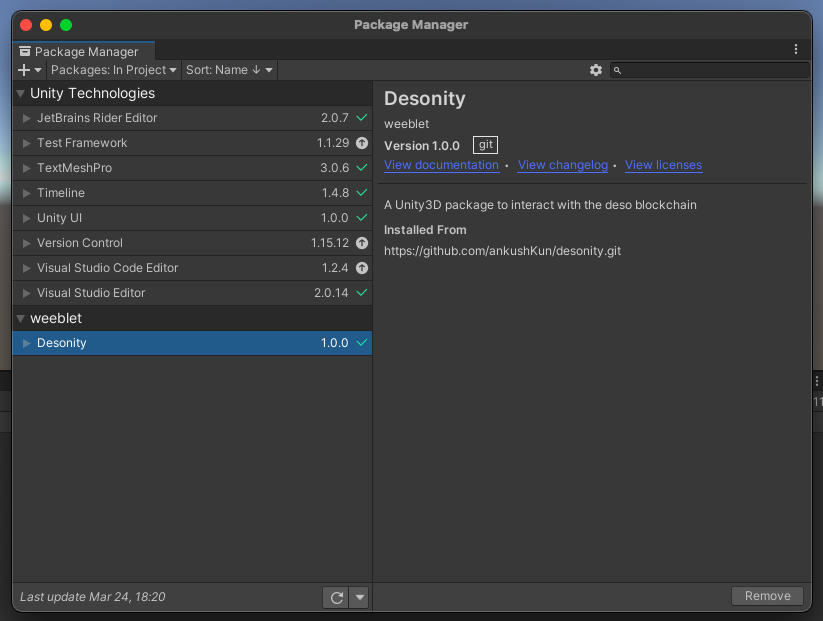

# Installing Desonity

## Step 1

In your Unity project open the package manager.

## Step 2

Click the add package button at the top left and choose Add package from git url.

## Step 3

Paste the url of this repo and click add

`https://github.com/ankushKun/desonity.git`

Unity will automatically clone the repo in your project packages and you should be able to use the Desonity namespace in your scripts.

## Buidl

Unity should compile your scripts and you should see Desonity appear in the list of installed packages

[< go back](../.)